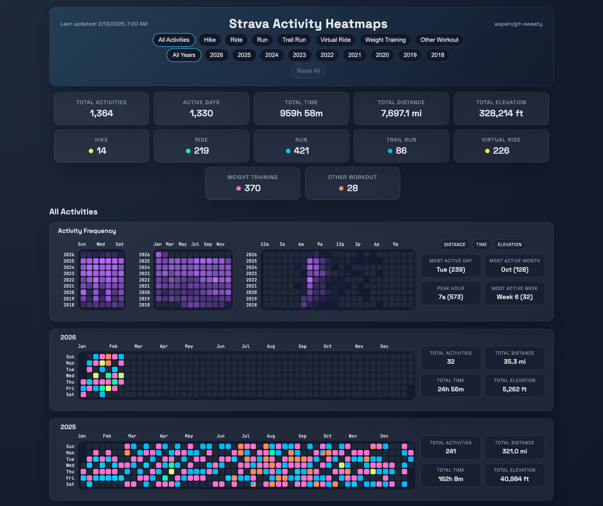

# Workout --> GitHub Heatmap Dashboard

Turn your Strava and Garmin activities into GitHub-style contribution heatmaps.  
Automatically generates a free, interactive dashboard updated daily on GitHub Pages.  
**No coding required.**  

- View the Interactive [Activity Dashboard](https://aspain.github.io/git-sweaty/)
- Once setup is complete, this dashboard link will automatically update to your own GitHub Pages URL.




## Quick Start

### Option 1 (Recommended): Run the setup script

Fastest path: fork, run one script, and let it configure the repository for you.

1. Fork this repo: [Fork this repository](../../fork)
2. Clone your fork and enter it:

   ```bash
   git clone https://github.com/<your-username>/<repo-name>.git
   cd <repo-name>
   ```
3. Sign in to GitHub CLI:

   ```bash
   gh auth login
   ```

4. Run setup:

   ```bash
   python3 scripts/setup_auth.py
   ```

   Follow the terminal prompts and choose a source:
      - `strava` (OAuth flow with `STRAVA_CLIENT_ID` and `STRAVA_CLIENT_SECRET`)
      - `garmin` (prompts for Garmin email/password, generates `GARMIN_TOKENS_B64`, and stores `GARMIN_TOKENS_B64` + Garmin email/password secrets for fallback auth)
      - unit preference (`US` or `Metric`)

   If you choose `strava`, create a [Strava API application](https://www.strava.com/settings/api) first and set **Authorization Callback Domain** to `localhost`.

   The setup may take several minutes to complete when run for the first time.  
   If any automation step fails, the script prints steps to remedy the failed step.  
   Once the script succeeds, it will provide the URL for your dashboard.

### Switching Sources Later

You can switch between `strava` and `garmin` any time, even after initial setup.

- Re-run `python3 scripts/setup_auth.py` and choose a different source (or pass `--source strava` / `--source garmin`).
- This updates `DASHBOARD_SOURCE`, so future scheduled runs use the new source until you change it again.
- The first sync after a source change resets provider-specific state and rebuilds from the selected source.
- Using the workflow **Run workflow** `source` input is a one-time override for that run only (it does not permanently change `DASHBOARD_SOURCE`).

### Option 2: Manual setup (no local clone required)

1. Fork this repo to your account: [Fork this repository](../../fork)

2. Add `DASHBOARD_SOURCE` repo variable (repo → [Settings → Secrets and variables → Actions](../../settings/variables/actions)):
   - `strava` or `garmin`

3. Add source-specific GitHub secrets (repo → [Settings → Secrets and variables → Actions](../../settings/secrets/actions)):
   - For `strava`:
      - `STRAVA_CLIENT_ID`
      - `STRAVA_CLIENT_SECRET`
      - `STRAVA_REFRESH_TOKEN`
      - You can generate/update the refresh token by running `python3 scripts/setup_auth.py --source strava` locally.
   - For `garmin`:
      - Preferred: `GARMIN_TOKENS_B64`
      - Fallback: `GARMIN_EMAIL` and `GARMIN_PASSWORD`

4. Enable GitHub Pages (repo → [Settings → Pages](../../settings/pages)):
   - Under **Build and deployment**, set **Source** to **GitHub Actions**.

5. Run [Sync Heatmaps](../../actions/workflows/sync.yml):
   - If GitHub shows an **Enable workflows** button in [Actions](../../actions), click it first.
   - Go to [Actions](../../actions) → [Sync Heatmaps](../../actions/workflows/sync.yml) → **Run workflow**.
   - Optional: override the source in `workflow_dispatch` input.
   - The same workflow is also scheduled in `.github/workflows/sync.yml` (daily at `15:00 UTC`).

6. Open your live site at `https://<your-username>.github.io/<repo-name>/` after deploy finishes.

### Unit Preference Precedence

- Option 1 stores your unit choice in repo variables:
  - `DASHBOARD_SOURCE`
  - `DASHBOARD_DISTANCE_UNIT`
  - `DASHBOARD_ELEVATION_UNIT`
- When those variables are set, workflow runs use them and override `config.yaml` units.
- If those variables are unset, workflow runs use `config.yaml` units (this is the default for Option 2/manual setup).
- To switch back to `config.yaml`-only unit control, delete those two repo variables in Settings → Secrets and variables → Actions, or:

  ```bash
  gh variable delete DASHBOARD_SOURCE
  gh variable delete DASHBOARD_DISTANCE_UNIT
  gh variable delete DASHBOARD_ELEVATION_UNIT
  ```

Both options run the same workflow, which will:
- restore persisted state from the `dashboard-data` branch (if present)
- sync raw activities into `activities/raw/<source>/` (local-only; not committed)
- normalize + merge into `data/activities_normalized.json` (persisted history)
- aggregate into `data/daily_aggregates.json`
- build `site/data.json`
- commit generated outputs to `dashboard-data` (not `main`)

## Updating Your Repository

- To pull in new updates and features from the original repo, use GitHub's **Sync fork** button on your fork's `main` branch.
- Activity data is stored on a dedicated `dashboard-data` branch and deployed from there, so generated outputs do not need to be committed on `main`.
- `main` is intentionally kept free of generated `data/` and `site/data.json` artifacts so fork sync stays cleaner.
- After syncing, run [Sync Heatmaps](../../actions/workflows/sync.yml) if you want your dashboard refreshed immediately.

## Configuration (Optional)

Everything in this section is optional. Defaults work without changes.
Base settings live in `config.yaml`.

Key options:
- `source` (`strava` or `garmin`)
- `sync.start_date` (optional `YYYY-MM-DD` lower bound for history)
- `sync.lookback_years` (optional rolling lower bound; used only when `sync.start_date` is unset)
- `sync.recent_days` (sync recent activities even while backfilling)
- `sync.resume_backfill` (persist cursor to continue older pages across days)
- `sync.prune_deleted` (remove local activities no longer returned by the selected source in the current sync scope)
- `activities.types` (featured/allowed activity types shown first in UI; key name is historical)
- `activities.include_all_types` (when `true`, include all seen sport types; when `false`, include only `activities.types`)
- `activities.exclude_types` (optional `SportType` names to exclude without disabling inclusion of future new types)
- `activities.group_other_types` (when `true`, allow non-Strava grouping buckets like `WaterSports`; default `false`)
- `activities.other_bucket` (fallback group name when no smart match is found)
- `activities.group_aliases` (optional explicit map of a raw/canonical type to a group)
- `activities.type_aliases` (optional map from raw source `sport_type`/`type` values to canonical names)
- `units.distance` (`mi` or `km`)
- `units.elevation` (`ft` or `m`)
- `rate_limits.*` (Strava API throttling caps; ignored for Garmin)

## Notes

- Raw activities are stored locally for processing but are not committed (`activities/raw/` is ignored). This prevents publishing detailed per-activity payloads and GPS location traces.
- If neither `sync.start_date` nor `sync.lookback_years` is set, sync backfills all available history from the selected source.
- A source marker (`data/source_state.json`) is persisted so switching from Strava to Garmin (or back) triggers a full reset (persisted outputs, provider backfill cursors, and local raw cache) before syncing from scratch.
- Strava backfill state is stored in `data/backfill_state_strava.json`; Garmin backfill state is stored in `data/backfill_state_garmin.json`.
- Manual workflow runs include a `full_backfill` toggle that clears persisted pipeline outputs and source backfill cursors before syncing.
- The GitHub Pages site is optimized for responsive desktop/mobile viewing.
